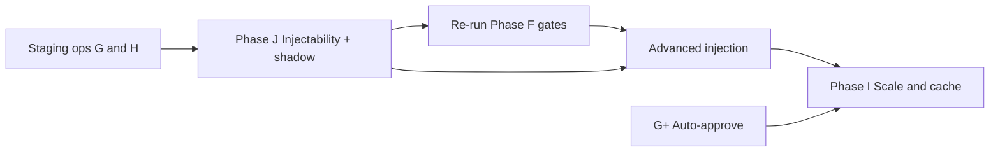

# Feedback Loop — Future Phases After H

**Date:** 2026-07-14  
**Purpose:** Roadmap for work **after Phase H** (and dependencies on gaps in [FEEDBACK_LOOP_GAPS_A_H.md](FEEDBACK_LOOP_GAPS_A_H.md)).  
**Prerequisite:** Phases A–H landed; prod baseline = feedback ON, calibration OFF, injection OFF.

**Staging ops still open** (engineering done; needs live DB / human review — see [§ Staging ops before J](#staging-ops-before-phase-j)):

- Approve ≥10 human-reviewed v2 hybrid rows  
- Run embedding backfill → centroids → routing MAE (API cost)  
- Everything else deferred to phases below

---

## Recommended order



0. **Staging ops** — approve v2 rows; backfill embeddings; run centroids + routing MAE  
1. **Phase J** — unlock whether lessons can affect scored percentiles + shadow mode  
2. **Re-run F** — go/no-go with meaningful injection/calibration arms; **prod flag flips** if GO  
3. **Advanced injection** — richer prompt blocks (after J proves signal path)  
4. **Phase I** — async queue, roll-ups, **Gemini context caching** (when volume/cost hurts)  
5. **G+** — auto-approve hybrid lessons when review quality is proven  

**Explicitly out of scope:** LLM-assigned `cluster_id` for routing (use embeddings + optional LLM labels only).

---

## Staging ops before Phase J

**Goal:** Finish human + data prerequisites so Phase H routing and Phase G hybrid staging are meaningful before injectability work.

These items were **ops-only** in [FEEDBACK_LOOP_GAPS_A_H.md](FEEDBACK_LOOP_GAPS_A_H.md); engineering (jobs, dashboard metrics, runbook checklist) is already landed.

### 1. Approve ≥10 v2 hybrid rows (Phase G DoD)

Human review only — cannot be automated.

1. On **Feedback Loop → Feedback loop settings**, enable **LLM hybrid (v2)** only. Keep **Calibration** and **Prompt injection** OFF.
2. Validate or backfill posts with `|prediction_delta| ≥ VALIDATION_FEEDBACK_LLM_DELTA_MIN` (default 10), or:
   ```bash
   python -m feedback.jobs.run_feedback_batch --limit 50
   ```
3. **Human review queue** — approve rows only when lessons cite grounded numbers (predicted/actual percentiles, deltas).
4. Confirm **Approved v2 ≥ 10** on the coverage panel, or:
   ```sql
   SELECT COUNT(*) FROM prediction_feedback
   WHERE feedback_version = 'v2' AND feedback_review_status = 'approved';
   ```
5. Note **Cost / 100 hybrid** on the dashboard for staging records.

Full checklist: [10_PRODUCTION_RUNBOOK.md](planning/validation-feedback-loop/10_PRODUCTION_RUNBOOK.md) § Phase G ops.

### 2. Embedding backfill + centroids + routing MAE (Phase H ops)

Pre-H predictions have `embedding = NULL`; ranked retrieve and centroid routing fall back until backfilled. **API cost** — start bounded.

```bash
# Preview eligible rows (no Gemini call)
python -m feedback.jobs.run_embedding_backfill --limit 50 --dry-run

# Bounded backfill, then refresh centroids and compare routing strategies
python -m feedback.jobs.run_embedding_backfill --limit 50
python -m feedback.jobs.run_cluster_centroids
python -m feedback.jobs.run_routing_mae_report --holdout-size 30
```

Reports land under `data/telemetry/routing_mae_*.json`. Re-run after major corpus import or bulk validation.

### Definition of done (staging ops)

- [ ] ≥10 approved v2 rows with factual grounding checked  
- [ ] Enough validated rows have embeddings for centroid job to write ≥1 centroid  
- [ ] At least one `routing_mae_*.json` saved for metadata vs centroid comparison  
- [ ] Injection and calibration remain OFF in prod until Phase J + F re-run  

---

## Phase J — Injectability unlock (highest priority)

**Goal:** Make learning mechanisms *measurable* on MAE (or agreed shadow metrics), not only reasoning.

### Problem today

`apply_deterministic_prediction` in `agents/predictor.py` overwrites the model percentile with the neighbor-weighted score after every predict. Injection and hybrid lessons cannot change the number Accuracy History grades.

### Build (suggested)

1. **Soft blend or staged lock**
   - Option A: `final = clamp(neighbor + w * (model_or_calibrated - neighbor), 0, 100)` with small `w` and a feature flag
   - Option B: Apply calibration offset *before* deterministic lock; log both raw and final
   - Option C: Dual-write — persist `shadow_percentile` in telemetry without changing user-facing score until gate passes

2. **Shadow mode** (pairs with J)
   - Run calibration + injection on every predict
   - Log `shadow_percentile`, `shadow_calibration_applied`, `shadow_feedback_count`
   - User-facing output stays current safe path
   - Dashboard or telemetry export: shadow vs live MAE over 2 weeks or 50+ predicts

3. **Settings**
   - `VALIDATION_SHADOW_MODE_ENABLED`
   - `VALIDATION_INJECTABILITY_MODE` = `hard_lock` | `soft_blend` | `shadow_only`

4. **Eval harness extension**
   - Arms that can differ once overwrite is softened (scaffold `*_v1|v2` arms already exist; MAE identical until J)
   - D-v2 (approved hybrid lessons) vs D-v1 numeric compare becomes meaningful post-J

### Carried from gaps appendix

| Gap | Handled here |
|-----|----------------|
| Deterministic percentile overwrite | Soft blend / shadow / dual-write above |
| Shadow mode | §2 Shadow mode — safe prod experiment before flag flips |
| Eval D-v2 vs D-v1 numeric lift | Blocked until non-`hard_lock` mode ships |

### Definition of done

- [ ] Shadow telemetry on every predict when enabled
- [ ] At least one non-`hard_lock` mode implemented behind a flag
- [ ] Re-run `run_feedback_evaluation`; injection arm MAE can differ from control
- [ ] Updated go/no-go doc if gates pass

### Estimated effort

1–2 PRs (telemetry + predictor post-process + settings).

---

## Phase F (re-run) — Prod learning ON/OFF

**Goal:** Data-driven flip of calibration and/or injection after J. Includes **re-opening go/no-go** and **prod flag flips** only when gates pass.

Current decision: **NO-GO** — see [11_GO_NO_GO.md](planning/validation-feedback-loop/11_GO_NO_GO.md) (calibration ~1.5% MAE lift < 5%; injection arms identical).

| Mechanism | Ship when | Kill when | Prod flag |
|-----------|-----------|-----------|-----------|
| Global calibration | MAE improves ≥5% vs raw, holdout≥30, 2 stable evals | MAE worsens ≥3% for 1 week | `VALIDATION_CALIBRATION_ENABLED=true` |
| Cluster calibration | Cluster training N≥50, beats global on holdout | Cluster \|mean_delta\| > 15 and N < 50 | Same flag; per-cluster source in telemetry |
| Injection | Arm with feedback beats calibrated-only on MAE or % within 10 | No lift after 100+ validated rows | `VALIDATION_FEEDBACK_INJECTION_ENABLED=true` |

**Shadow mode first:** run J shadow telemetry for 2 weeks or 50+ predicts; compare shadow vs live MAE before flipping dashboard overrides.

**Commands:**

```bash
python -m feedback.jobs.run_feedback_evaluation --holdout-size 30
```

Update [11_GO_NO_GO.md](planning/validation-feedback-loop/11_GO_NO_GO.md) and dashboard overrides if GO. Do **not** flip flags without two stable eval runs for calibration.

### Carried from gaps appendix

| Gap | Handled here |
|-----|----------------|
| Prod calibration ON | Global gate ≥5% MAE lift |
| Prod injection ON | Requires Phase J + injection arm lift |
| Re-open go/no-go | This section after fresh eval |
| Per-cluster calibration prod decision | Separate row in table above |
| Prod learning flags OFF (policy) | Flipped only via this gate process |

---

## Advanced prompt injection (post-J)

**Goal:** Better lesson *content* and *structure* once the numeric path can use or shadow them.

Not security “prompt injection” — this is **closed-loop context** in the Predictor prompt.

| Technique | What | Why |
|-----------|------|-----|
| Cluster roll-up | One paragraph: mean_delta, common miss patterns, N | Smaller stable prefix; pairs with caching |
| Summary + top-2 examples | Replace 5 full lesson rows | Token cost + focus |
| Contrastive pairs | Big miss vs near-hit in same cluster | Teaches direction without prose dump |
| Structured bias hints | JSON fields: `cluster_mean_delta`, `direction` | Grounded numbers, less hallucination surface |
| Diversity in rank | MMR on embedding similarity | Avoid redundant lessons |
| Live retrieve at predict | Query validated store by vector, not only pre-stored feedback rows | Fresher signal; more moving parts |

**Prerequisite:** Phase J (or explicit reasoning-only success metrics).

**Files to extend:** `feedback/retrieve.py`, `agents/predictor.py`, optional `feedback/summarize.py` job.

### Carried from gaps appendix

| Gap | Handled here |
|-----|----------------|
| Advanced injection formats (cluster summary, contrastive pairs) | Techniques table above |
| Prod injection with approved v2 | Phase F injection gate after J |

---

## Phase I — Scale & cost (P3)

**Goal:** Sustainable worker latency and Gemini cost at higher validation volume.

From [FEEDBACK_LOOP_PART2_PLAN.md](FEEDBACK_LOOP_PART2_PLAN.md) § Phase I.

### 1. Async feedback queue

- Worker enqueues `prediction_id` after `mark_validated`
- Separate job processes queue; idempotent upsert; dead-letter on failure
- Decouple rescrape success from feedback + LLM latency

### 2. Cluster roll-up summaries

- Periodic job: one paragraph per cluster
- Inject summary + top 2 examples instead of 5 full rows

### 3. Gemini context caching

- Cache stable prefix: global instructions + cluster summary
- Refresh on cluster stats / centroid recompute
- Track cache hit rate in telemetry
- **Deferred from Phase D** — stable prefix not large enough to justify until roll-ups ship (see Advanced injection)

### 4. Multi-window validation (optional)

- Coordinate with T7: 48h primary grade; optional 7d snapshot
- Feedback version tied to validation window

### Definition of done

- [ ] Worker p99 unchanged when LLM feedback enabled
- [ ] Token cost per predict reduced ≥20% vs uncached at target volume
- [ ] Queue backlog visible in dashboard or logs

### When to start

When hybrid feedback volume or predict latency becomes painful — often **after** J + partial prod ON.

### Carried from gaps appendix

| Gap | Handled here |
|-----|----------------|
| Gemini context caching (Phase D deferral) | §3 above |

---

## Phase H+ — Routing extensions (optional)

**Goal:** Improve cluster geometry when metadata buckets are too coarse. **Not blocking** Phase J.

### k-means / incremental centroids

Today `run_cluster_centroids` uses **mean embedding per metadata cluster**. True k-means (or incremental centroid updates) deferred until N per cluster justifies re-partitioning.

**Build when:**

- Metadata vs centroid routing MAE report shows clusters with high internal variance
- Enough embedded validated rows (post backfill) for stable k per segment

**Suggested approach:**

- Offline k-means per length bucket or globally; assign `cluster_id` from centroid table (still deterministic at predict time)
- Job: `feedback/jobs/run_kmeans_clusters.py` (new) — output new centroid rows, do not mutate metadata ids in v1

### Optional LLM cluster labels (dashboard only)

- Human-friendly names for `prediction_clusters.label` — **does not affect routing**
- Low priority; `cluster_label()` remains deterministic string formatting for routing
- Could run as one-off dashboard enrichment after centroids stabilize

### Carried from gaps appendix

| Gap | Handled here |
|-----|----------------|
| k-means / incremental centroids | § k-means above |
| LLM cluster labels | § Optional LLM cluster labels |
| Offline metadata vs embedding routing MAE | Staging ops — run `run_routing_mae_report` |

---

## Phase G+ — Auto-approve hybrid lessons

**Goal:** Remove human bottleneck once staging proves low reject rate.

### Build

- Auto-approve when: schema valid, grounding check passed, \|delta\| below cap, daily budget OK
- Settings: `VALIDATION_FEEDBACK_AUTO_APPROVE_ENABLED`, max auto-approved per day
- Audit log for auto-approved rows

### Definition of done

- [ ] ≥50 manual reviews completed first
- [ ] Reject rate < 10% over rolling window
- [ ] Auto-approve only in staging until second review pass

**Do not** auto-approve before Phase J unless injection remains reasoning-only.

### Carried from gaps appendix

| Gap | Handled here |
|-----|----------------|
| Auto-approve v2 | This phase (explicitly deferred from A–H fill) |
| Prod injection with approved v2 | Blocked until Phase J + Phase F injection gate |

---

## Phase K (optional) — Corpus & benchmark versioning

**Goal:** Prevent silent lesson rot when corpus percentiles refresh.

Peer review P1; not fully scoped in A–H.

- Pin `corpus_benchmark_version` / snapshot id on `predictions` at validate time
- Regenerate feedback only on version bump
- Accuracy History segment by benchmark version

### Carried from gaps appendix

| Gap | Handled here |
|-----|----------------|
| Corpus / benchmark version on predictions | This phase |

---

## Explicitly not planned

| Idea | Reason |
|------|--------|
| LLM-assigned cluster IDs | Non-deterministic; peer review ruled out |
| Fine-tuning predictor / embeddings | [05_TECHNICAL_APPROACH.md](planning/validation-feedback-loop/05_TECHNICAL_APPROACH.md) |
| Tabular / transformer models on features | Same |
| Backfill validated posts into main corpus | Defer until 48h window trusted |

---

## Success metrics (future prod)

| KPI | Source | Target (initial) |
|-----|--------|------------------|
| Shadow vs live MAE delta | Phase J telemetry | Document before prod flip |
| Calibration apply rate | `PredictionTelemetry` | Logged; not 100% until N sufficient |
| Hybrid reject rate | Review queue | < 10% before G+ |
| Injection token cost | Telemetry | Below eval cost warning threshold |
| Cache hit rate | Phase I | TBD after cache ships |
| Per-cluster MAE (embedding vs metadata) | Phase H report | No cluster > 2× global |

---

## Doc map

| Doc | Role |
|-----|------|
| [FEEDBACK_LOOP_GAPS_A_H.md](FEEDBACK_LOOP_GAPS_A_H.md) | Incomplete A–H items; out-of-scope appendix points here |
| [FEEDBACK_LOOP_PART2_PLAN.md](FEEDBACK_LOOP_PART2_PLAN.md) | Original Part 2 spec |
| [planning/validation-feedback-loop/09_BUILD_PLAN.md](planning/validation-feedback-loop/09_BUILD_PLAN.md) | Living build tracker |
| [planning/validation-feedback-loop/10_PRODUCTION_RUNBOOK.md](planning/validation-feedback-loop/10_PRODUCTION_RUNBOOK.md) | Staging ops checklists |
| [planning/validation-feedback-loop/11_GO_NO_GO.md](planning/validation-feedback-loop/11_GO_NO_GO.md) | Current prod decision |

---

## Gaps appendix index (A–H → this doc)

Consolidated map from [FEEDBACK_LOOP_GAPS_A_H.md](FEEDBACK_LOOP_GAPS_A_H.md) out-of-scope appendix.

| Item from gaps MD | Where in this doc |
|-------------------|-------------------|
| Approve ≥10 v2 rows | [Staging ops before Phase J](#staging-ops-before-phase-j) |
| Embedding backfill + centroids + routing MAE | [Staging ops before Phase J](#staging-ops-before-phase-j) |
| Phase J soft overwrite + shadow mode | [Phase J](#phase-j--injectability-unlock-highest-priority) |
| Shadow mode (Phase F deferral) | Phase J §2; Phase F re-run (shadow before flip) |
| Prod calibration / injection ON | [Phase F (re-run)](#phase-f-re-run--prod-learning-onoff) |
| Re-open go/no-go | [Phase F (re-run)](#phase-f-re-run--prod-learning-onoff) |
| Per-cluster calibration prod decision | Phase F table |
| Gemini context caching | [Phase I](#phase-i--scale--cost-p3) §3 |
| Advanced injection formats | [Advanced prompt injection](#advanced-prompt-injection-post-j) |
| Auto-approve v2 | [Phase G+](#phase-g--auto-approve-hybrid-lessons) |
| Prod injection with approved v2 | Phase F + G+ (after J) |
| k-means / incremental centroids | [Phase H+](#phase-h--routing-extensions-optional) |
| LLM cluster labels | [Phase H+](#phase-h--routing-extensions-optional) |
| Corpus/benchmark version on predictions | [Phase K](#phase-k-optional--corpus--benchmark-versioning) |
| Deterministic percentile overwrite | [Phase J](#phase-j--injectability-unlock-highest-priority) |
| Eval D-v2 vs D-v1 numeric lift | Phase J (scaffold exists; MAE unlock post-J) |

**Next implementation chat:** Complete **staging ops**, then **Phase J** (shadow + soft overwrite), then re-run Phase F eval.
