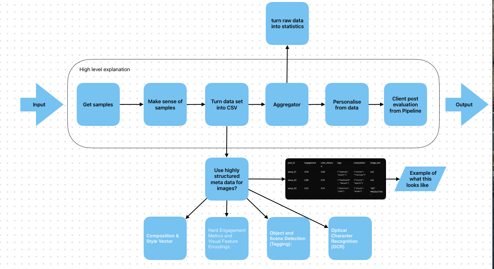

So just to sum up in basic terms.

Get samples (scraper stage)> make sense of samples (ai pipe line, this step would find common trends and patterns in what’s popular )> turn into data set (some sort of csv which stores tends and) > ai fine tuned/ personalised on this data (user could upload LinkedIn post and our system would look for matches with what’s popular and give some sort of score or even rewire the original post based of dataset from the set before)

This could also easily be done with images and videos using Gemini and ocr models

