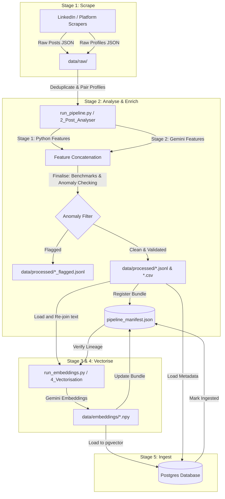

# Pipeline Architecture & Data Lineage

This document explains how the Social Media Prediction Tool processing pipeline operates, how data flows from stage to stage, and the architectural principles behind these design decisions.

---

## High-Level Architecture Overview

The system is built as a multi-stage, data-validated pipeline that turns raw social media scrapes into structured, enriched, and vector-embedded datasets suitable for semantic search and AI prediction. 

The stages of the pipeline are:
1. **Scraper Stage (Unified Collection)**: Gathers posts and profiles.
2. **Analysis & Enrichment (Step 2)**: Deduplicates, enriches profiles, runs Python & Gemini feature extractors, detects anomalies, and validates schemas.
3. **Vectorisation (Step 3 & 4)**: Computes vector embeddings using Gemini models.
4. **Ingestion (Step 5)**: Postgres/pgvector insertion for retrieval.

---

## Detailed Data Flow & State Transitions

### Stage 1: Scraper Stage (Unified Collection)
* **Entry Point**: `processors/run_sample_collection.py` or the UI `1_Scraper_Stage.py`.
* **Inputs**: Query parameter filters (e.g. keywords, limits).
* **Outputs**: 
  - `data/raw/linkedin_posts_<timestamp>.json`
  - `data/raw/linkedin_profiles_<timestamp>.json`
* **Why this is combined**: Historically, posts and author profiles were scraped in separate independent stages. Combining them ensures that profile data matches the exact temporal window of the collection, minimizing profile stale-state metrics (e.g., follower counts) and reducing visual test complexity.

### Stage 2: Post Analysis & Enrichment
* **Entry Point**: `processors/run_pipeline.py` or the UI `2_Post_Analyser.py`.
* **Inputs**: One or more raw post scans from `data/raw/`.
* **Steps**:
  1. **Concatenate & Deduplicate**: Merges selected raw scans and strips exact-duplicate content by post URL/ID before running heavy computations.
  2. **Profile Enrichment**: Pulls author metadata from the paired profile file and attaches it (e.g. followers) to the post object.
  3. **Stage 1 (Local Python Features)**: Computes deterministic linguistic features locally (e.g. word count, sentence count, emoji density, reading ease index).
  4. **Stage 2 (LLM Gemini Features)**: If selected, calls `gemini-2.5-flash-lite` to extract subjective parameters (e.g. hooks, readability, core thesis, structural formatting).
  5. **Finalisation**: Passes records to `processors/finalize_records.py` to:
     - Apply engagement benchmarks (raw and audience-adjusted).
     - Run statistical anomaly detection to identify posts polluted by bot engagement/pods. Flagged posts are held back in a separate `*_flagged.jsonl` file.
     - Validate clean posts against the Pydantic `NormalizedPost` schema.
* **Outputs**:
  - `data/processed/linkedin_analysed_<timestamp>.jsonl`
  - `data/processed/linkedin_analysed_<timestamp>.csv`
  - `data/processed/linkedin_analysed_flagged_<timestamp>.jsonl` (optional)
  - `data/processed/corpus_benchmarks.json` (benchmark metrics)

### Stage 3 & 4: Vectorisation (Embedding Generation)
* **Entry Point**: `processors/run_embeddings.py` or the UI `4_Vectorisation.py`.
* **Inputs**: An analysed dataset bundle from Stage 2.
* **Steps**:
  1. Resolves the source scraper filenames using the pipeline registry.
  2. Re-joins the raw text content back to the processed records.
  3. Batch-embeds the text content using `gemini-embedding-001`.
* **Outputs**:
  - `data/embeddings/linkedin_gemini_<timestamp>.npy` (numpy matrix)

### Stage 5: Database Ingestion
* **Entry Point**: `processors/run_db_ingest.py` or command execution.
* **Inputs**: The `.npy` embeddings matrix and the corresponding `.jsonl` processed metadata file.
* **Steps**:
  - Maps rows to the database schema.
  - Inserts embeddings into the HNSW index on the `posts` table in Postgres.
* **Outputs**: Rows committed to the Postgres database.

---

## Design Rationale ("Why")

### 1. The Pipeline Bundle Registry (`data/pipeline_manifest.json`)
Instead of allowing downstream steps (embedding, ingestion) to arbitrarily read any file on disk, we enforce **strict lineage** via a centralized registry.
* **Lineage Tracking**: Each logical pipeline execution is registered as a "bundle" containing references to the exact raw files, processed outputs, embeddings, and database load status.
* **Verification**: Downstream steps inspect the manifest. They will reject datasets that have not successfully completed the previous required stages (e.g. you cannot generate embeddings for a dataset that has not passed through Step 2 schema validation).

### 2. Sidecar Metadata Files (`.meta.json`)
Beside every processed JSONL and NPY file, the system writes a matching `.meta.json` file.
* **Decentralization**: If the master `pipeline_manifest.json` is deleted or corrupted, the individual files remain self-documenting. The system can synthesize missing manifest entries dynamically by parsing these sidecar files.

### 3. Deduplication at the Start of Analysis
Deduplication is performed *before* benchmarks are run and *before* Gemini is queried.
* **Statistical Integrity**: Duplicate posts skew engagement benchmarks and anomaly detection thresholds.
* **Cost Prevention**: Deduplication prevents sending duplicate posts to the Gemini API, avoiding wasted tokens.

### 4. Splitting Python Features and LLM Features
Features are split into Stage 1 (Python) and Stage 2 (Gemini).
* **Cost Control**: Stage 1 is local, instantaneous, and free. Developers can test processing, deduplication, and database pipelines without incurring API costs. Stage 2 (Gemini) is only activated when LLM classification is explicitly needed.

### 5. Holding Back Flagged Anomalies
Posts with statistically implausible engagement ratios (e.g. extremely high comment-to-like ratios typical of comment pods or bot automation) are flagged and held back.
* **Baseline Purity**: Leaving these posts in the dataset corrupts benchmark baselines.
* **Manual Review**: Rather than deleting them silently, they are isolated in a flagged file for developer analysis.
