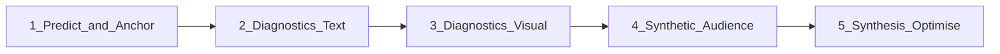

# Phase 7 — Multi-Agent Evaluation Pipeline

**Status:** Planning / implement one-by-one  
**Owner (sheet):** Erdal  
**Models:** Gemini throughout (repo default: `gemini-2.5-flash-lite` via `AGENT_GEMINI_MODEL`; embeddings already `gemini-embedding-001` @ 3072-dim)  
**Not to confuse with:** historical “T7 Independent Modules” naming — that backlog is now **[Phase 9](Phase_9.md)** (A1–A4 only).

This phase expands the live evaluation cycle into a fuller multi-agent pipeline: retrieve → baseline predict → text/visual diagnostics → synthetic audience → synthesis rewrites.

**Related (already built):** Phase 3 cycle in [`agents/orchestrator.py`](agents/orchestrator.py) — Stage 1 retrieval, Predictor + seo/clarity/tone diagnostics, Variant Optimisation Engine.

---

## Pipeline stages

| Stage | Agents | Notes |
|-------|--------|-------|
| **1. Predict & Anchor** | T7.1, T7.2 | Ground in real neighbors, then baseline score |
| **2. Diagnostics (Text)** | T7.3–T7.8 | T7.3 skipped; T7.4–T7.5 Partial; T7.6–T7.8 later |
| **3. Diagnostics (Visual)** | T7.9–T7.10 | Combined multimodal agent; **off by default** |
| **4. Synthetic Audience** | T7.11–T7.13 | Combined independent critic; **not in evaluate loop** |
| **5. Synthesis (Optimise)** | T7.14–T7.16 | On hold; closest today is the variant engine |

---

## Agent index

| ID | Agent | Status | Stage | Sheet output shape | Model (this repo) | Notes |
|----|-------|--------|-------|--------------------|-------------------|-------|
| **T7.1** | Historical Context Retriever | **Done** (mapped) | 1. Predict & Anchor | `[{post_id, engagement_score, text}, …]` | `gemini-embedding-001` (3072-dim) | See [explainer](#t71--historical-context-retriever) |
| **T7.2** | Base Predictor Agent | **Done** (mapped) | 1. Predict & Anchor | `{baseline_score, confidence_interval}` | `gemini-2.5-flash-lite` | See [explainer](#t72--base-predictor-agent) |
| **T7.3** | Hook & Scroll-Stop Agent | **Skipped** (for now) | 2. Diagnostics (Text) | `{hook_strength, is_truncated, critique}` | Gemini | Soft coverage exists; no dedicated agent — see [explainer](#t73--hook--scroll-stop-agent) |
| **T7.4** | SEO & Semantic Intent Agent | **Partial** | 2. Diagnostics (Text) | `{search_intent, missing_keywords}` | Gemini | Corpus-grounded SEO done; pytrends Tier 2 opt-in — deepen later — see [explainer](#t74--seo--semantic-intent-agent) |
| **T7.5** | Cognitive Load & Clarity Agent | **Partial** (metrics grounded) | 2. Diagnostics (Text) | `{flesch_kincaid_grade, jargon_density_percent}` | Gemini | Deterministic metrics → clarity prompt; schema still `DiagnosticOutput` — see [explainer](#t75--cognitive-load--clarity-agent) |
| **T7.6** | Tone & Brand Voice Agent | **Later** | 2. Diagnostics (Text) | `{tone_alignment_score, flagged_phrases}` | Gemini | Soft coverage via tone + voice_profile; deepen when clients need guidelines — see [explainer](#t76--tone--brand-voice-agent) |
| **T7.7** | Brand Safety & Risk Agent | **Later** | 2. Diagnostics (Text) | `{risk_level, flagged_liabilities}` | Gemini | Defer until client feedback / real risk in data — see [explainer](#t77--brand-safety--risk-agent) |
| **T7.8** | Originality & Cliché Agent | **Later** | 2. Diagnostics (Text) | `{cliche_count, suggested_removals}` | Gemini | Skip for now — see [explainer](#t78--originality--cliché-agent) |
| **T7.9** | Visual Hierarchy Agent | **Partial** (opt-in) | 3. Diagnostics (Visual) | `{contrast_pass, visual_clutter}` | Gemini multimodal | Combined with T7.10; off by default — see [explainer](#t79--t710--visual-diagnostics-combined-opt-in) |
| **T7.10** | OCR & Asset Alignment Agent | **Partial** (opt-in) | 3. Diagnostics (Visual) | `{extracted_text, copy_alignment_score}` | Gemini multimodal | Same agent as T7.9; Gemini vision OCR-like — see [explainer](#t79--t710--visual-diagnostics-combined-opt-in) |
| **T7.11** | C-Suite / Enterprise Persona | **Partial** (opt-in side-step) | 4. Synthetic Audience | `{reaction, primary_objection}` | Gemini | Combined with T7.12–T7.13; independent of evaluate loop — see [explainer](#t711--t712--t713--synthetic-audience-critic-combined-independent) |
| **T7.12** | End-User / Practitioner Persona | **Partial** (opt-in side-step) | 4. Synthetic Audience | `{reaction, perceived_value}` | Gemini | Same agent as T7.11 |
| **T7.13** | Industry Peer / Competitor Persona | **Partial** (opt-in side-step) | 4. Synthetic Audience | `{reaction, credibility_check}` | Gemini | Same agent as T7.11 |
| **T7.14** | Algorithmic Maximizer Agent | **Partial** | 5. Synthesis (Optimise) | `{variant_name, optimized_text}` | Gemini | Closest: [`agents/variant_engine.py`](agents/variant_engine.py) strategies — not Hook+SEO+Clarity-driven maximizer |
| **T7.15** | Strategic Counter-Agent | Not started | 5. Synthesis (Optimise) | `{variant_name, optimized_text}` | Gemini | On hold; needs T7.11 objections |
| **T7.16** | Brand Purist Agent | Not started | 5. Synthesis (Optimise) | `{variant_name, optimized_text}` | Gemini | On hold; needs T7.6 / T7.7 |

**Counts:** Done 2 · Partial 8 · Skipped 1 · Later 3 · Not started 2.

---

## T7.1 — Historical Context Retriever

**What the sheet means:** Before the LLM judges a draft, pull the **10 closest historical posts** from Postgres (pgvector) so the evaluation is grounded in **real engagement**, not the model’s flattery bias (“this will crush it”).

**What already exists (treat as Done):**

| Piece | Where |
|-------|--------|
| Embed draft query | [`processors/embedder.py`](processors/embedder.py) → `embed_query()` |
| Top-10 neighbors | [`storage/vector_store.py`](storage/vector_store.py) → `find_similar()` |
| Wired into every eval | [`agents/orchestrator.py`](agents/orchestrator.py) → `_gather_similar_posts()` |
| Standalone API | `POST /api/v1/similar-posts` in [`api/main.py`](api/main.py) |

**Diff vs sheet:** Sheet listed OpenAI `text-embedding-3-large` @ 768-dim. This repo uses **Gemini `gemini-embedding-001` @ 3072-dim** (already ingested). Neighbor payload is richer than `{post_id, engagement_score, text}` (`SimilarPost` includes percentiles, ratios, etc.).

**Enhancement:** optional `neighbor_limit` (default **10**, max **100**) on evaluate API + Evaluation Cycle dashboard — widens the comparison surface without changing the default. See `resolve_neighbor_limit` in [`agents/schemas.py`](agents/schemas.py).

**Do not rebuild** as a parallel retriever — improve neighbor quality / backtests if needed.

---

## T7.2 — Base Predictor Agent

**What the sheet means:** Turn RAG neighbors into a **baseline quantitative score** *before* diagnostics rewrite or spin the narrative. Anchors the rest of the pipeline.

**What already exists (treat as Done):**

| Piece | Where |
|-------|--------|
| Deterministic neighbor baseline | [`processors/benchmark.py`](processors/benchmark.py) → `compute_neighbor_prediction()` |
| Predictor agent (explains + structured output) | [`agents/predictor.py`](agents/predictor.py) |
| Numerics locked to math, not LLM whim | `apply_deterministic_prediction()` in the orchestrator path |

**Diff vs sheet:** No `confidence_interval` field yet. Diagnostics today are **parallel quality scores** (seo / clarity / tone); they do **not** mutate the engagement percentile. Sheet imagined diagnostics altering the score after the baseline — that fusion is still future work if you want it.

**Do not rebuild** the Predictor from scratch — optional later: expose explicit `baseline_score` + `confidence_interval` in the API if stakeholders need that shape.

---

## T7.3 — Hook & Scroll-Stop Agent

**What the sheet means:** Aggressively analyze only the **first ~150 characters** for curiosity gaps, contrarian takes, or immediate value. Targets the “low impression / no scroll-stop” failure mode. Sheet output shape: `{hook_strength, is_truncated, critique}`.

**Decision: skipped for now** — do not build a dedicated Hook agent in this pass.

**Why skip:** Soft coverage already exists elsewhere; a separate agent would mostly restate that with more LLM cost.

| Soft coverage | Where | Gap vs T7.3 |
|---------------|--------|-------------|
| `hook_type` taxonomy | [`processors/post_analyser.py`](processors/post_analyser.py) | Label only — not strength / critique |
| Hook vs neighbors in reasoning | [`agents/predictor.py`](agents/predictor.py) | Prose, not `{hook_strength, is_truncated, critique}` |
| Opening-line check | [`agents/discoverability.py`](agents/discoverability.py) | Hashtag-leading only (SEO), not scroll-stop |
| Bold-hook rewrites | [`agents/variant_engine.py`](agents/variant_engine.py) | Fixes openings; doesn’t score the draft’s hook |

**Not the same as learning buckets:** feedback buckets use **word count** (`short` / `medium` / `long`, with medium &lt; **150 words**) × format × followers — routing shape, not first-~150-**character** scroll-stop critique. Format only peeks at the first ~240 chars for a `?`. See [`feedback/routing.py`](feedback/routing.py).

**If revisited later:** fold a cheap first-150-char check into an existing diagnostic or the predictor — don’t add a parallel agent just to “split” the opening.

---

## T7.4 — SEO & Semantic Intent Agent

**What the sheet means:** Validate keyword density, entity salience, and whether the draft fulfills the audience’s search intent so posts don’t die in algorithmic discovery. Sheet output shape: `{search_intent, missing_keywords}`.

**What already exists (treat as Partial — grounded SEO path is live):**

| Piece | Where |
|-------|--------|
| SEO diagnostic worker | [`agents/diagnostics.py`](agents/diagnostics.py) → `build_seo_agent` / `build_seo_prompt` |
| Corpus-grounded context assembly | [`agents/discoverability_context.py`](agents/discoverability_context.py) → `gather_discoverability_context` |
| Deterministic checks + neighbor SEO summary | [`agents/discoverability.py`](agents/discoverability.py) |
| Corpus norms (hashtags, word-count ranges, etc.) | [`processors/corpus_benchmarks.py`](processors/corpus_benchmarks.py) |
| Wired into every eval (when `seo_mode=corpus`) | [`agents/orchestrator.py`](agents/orchestrator.py) |
| Dashboard / API toggle | Evaluation Cycle + `seo_mode` / `use_google_trends` on evaluate |

**Corpus-grounded SEO (Tier 1, default):** before the SEO agent runs, the loop pre-computes evidence from *your* scraped dataset — corpus norms, deterministic opening/hashtag checks, and a summary of similar posts — then injects that block into the SEO prompt. The model scores against real corpus patterns, not invented keywords. Mode `gemini_only` skips that grounding (legacy baseline).

**Google Trends / pytrends (Tier 2, opt-in):** same SEO path, optional freshness layer — **not a second product**.

| Surface | Role |
|---------|------|
| SEO diagnostic (loop) | Draft keywords → pytrends → injected into SEO prompt as rising/falling search-interest signals |
| Eval Cycle “try me” panel | Same fetch result, rendered as suggestions ([`dashboard/trend_signals_ui.py`](dashboard/trend_signals_ui.py)) |

Shared module: [`processors/trend_signals/google_trends.py`](processors/trend_signals/google_trends.py). Toggle via `use_google_trends` / `GOOGLE_TRENDS_ENABLED` (off by default; always off in `gemini_only`). Disclaimer: **web-wide search interest, not LinkedIn feed performance**.

**Not the same as A2 Trend Radar:** A2 is **corpus topic drift** inside scraped posts ([`phase_modules/A2_TREND_RADAR.md`](phase_modules/A2_TREND_RADAR.md)). pytrends is external search curves for SEO timeliness.

**Diff vs sheet:** Output is still generic `DiagnosticOutput` (score / flaws / advantages / improvements) — not `{search_intent, missing_keywords}`.

**Come back later (planning, not this pass):** stronger use of pytrends or similar external trend APIs (scheduled library, popular-content sources, broader than on-demand keyword curves) is tracked as a Phase 9–adjacent consideration — see [`phase_modules/CONSIDERATION_EXTERNAL_TREND_TRACKER.md`](phase_modules/CONSIDERATION_EXTERNAL_TREND_TRACKER.md). Don’t bolt that onto T7.4 mid-pipeline; deepen sheet schema / external radar when product prioritizes it.

**Do not rebuild** the SEO diagnostic — treat corpus grounding as Done enough; revisit schema + external trends later.

---

## T7.5 — Cognitive Load & Clarity Agent

**What the sheet means:** Fix “wall of text” — reading grade, jargon density, mobile line breaks / bullets. Sheet output shape: `{flesch_kincaid_grade, jargon_density_percent}`.

**What this does (not corpus labeling):** Live **draft critique** for the post you’re evaluating — how hard it is to skim on mobile — not tagging historical posts into buckets.

**What already exists (metrics grounding shipped):**

| Piece | Where |
|-------|--------|
| Deterministic metrics | [`agents/clarity_metrics.py`](agents/clarity_metrics.py) → `compute_clarity_metrics()` |
| Prompt injection | [`agents/diagnostics.py`](agents/diagnostics.py) → `build_clarity_prompt()` |
| Wired every eval | [`agents/orchestrator.py`](agents/orchestrator.py) + Evaluation Cycle dashboard |
| Visible on scorecard | Evaluation Cycle “Clarity metrics” panel (`clarity_context` on `PostEvaluationState`) |

**How it works:** Before the clarity agent runs, Python computes Flesch–Kincaid grade, jargon density %, paragraph/line-break/bullet structure, and a wall-of-text flag. That block is injected into the existing clarity prompt (same pattern as discoverability → SEO). Still **one** clarity agent — no parallel Cognitive Load agent.

**Diff vs sheet:** Metrics live on `clarity_context` / prompt evidence. Agent output remains generic `DiagnosticOutput` (score / flaws / improvements), not a dedicated `{flesch_kincaid_grade, jargon_density_percent}` response schema. FK is a supporting signal — structure + jargon matter more for LinkedIn.

**Do not rebuild** as a separate agent — optionally later expose sheet-shaped fields on the API if stakeholders need them.

---

## T7.6 — Tone & Brand Voice Agent

**What the sheet means:** Compare the draft to agency/client style guidelines and winning historical posts. Sheet output shape: `{tone_alignment_score, flagged_phrases}`.

**Decision: later** — do not deepen in this pass.

**Why later:** Enough soft coverage already exists for current product needs. Full sheet shape needs real client guideline docs and a flagged-phrases workflow we don’t have yet.

| Soft coverage today | Where | Gap vs T7.6 |
|---------------------|--------|-------------|
| Tone diagnostic | [`agents/diagnostics.py`](agents/diagnostics.py) | Generic score / flaws — not guideline alignment |
| Subscriber voice profile | `voice_profile` via orchestrator + vector store | Personal writing style, not agency brand books |
| Tone / hook labels on corpus | [`processors/post_analyser.py`](processors/post_analyser.py) | Historical tags, not live guideline checks |

**If revisited later:** deepen when a client brings style guidelines (or we need `flagged_phrases` / explicit `tone_alignment_score`). Prefer extending the existing tone diagnostic over a parallel Brand Voice agent. T7.16 (Brand Purist) can wait on the same decision.

---

## T7.7 — Brand Safety & Risk Agent

**What the sheet means:** PR guardrail — controversial phrasing, aggressive takedowns, regulatory risk (FinTech / Healthcare). Sheet output shape: `{risk_level, flagged_liabilities}`.

**Decision: later** — do not build now.

**Why later:** Useful as a client-facing safety net, but not justified until we see real demand. Revisit only if clients come back with advice *or* graded / reviewed data shows drafts that are offensive, legally sensitive, or brand-damaging. Unlikely to be a frequent failure mode in current B2B LinkedIn usage; don’t invent a risk agent preemptively.

**If revisited later:** same `DiagnosticOutput` pattern as seo/clarity/tone (or sheet-shaped `{risk_level, flagged_liabilities}`). Keep it opt-in / client-scoped for regulated verticals rather than a default on every eval. T7.16 may depend on this.

---

## T7.8 — Originality & Cliché Agent

**What the sheet means:** Flag ChatGPT-speak and LinkedIn platitudes (“In today’s fast-paced…”, “Delve into”). Sheet output shape: `{cliche_count, suggested_removals}`.

**Decision: later** — skip for now (same call as T7.6 / T7.7).

**Why later:** Nice-to-have polish, not a core eval gap today. Soft overlap with tone/clarity/variants already nudging away from generic phrasing. Revisit if drafts or client feedback consistently look templated / AI-slop heavy.

**If revisited later:** cheap lexicon + LLM pass on the existing diagnostic pattern, or fold into tone/clarity rather than a standalone agent.

---

## T7.9 + T7.10 — Visual Diagnostics (combined, opt-in)

**What the sheet means:**

| ID | Job | Sheet shape |
|----|-----|-------------|
| **T7.9** | Thumbnail / image hierarchy: contrast, clutter, text-to-graphic balance | `{contrast_pass, visual_clutter}` |
| **T7.10** | OCR on-image text; check it matches the caption (anti-clickbait) | `{extracted_text, copy_alignment_score}` |

**Decision: shipped together as one multimodal agent, off by default.**

| Piece | Where |
|-------|--------|
| Combined agent | [`agents/visual_diagnostics.py`](agents/visual_diagnostics.py) |
| Toggle | `VISUAL_DIAGNOSTICS_ENABLED` (default **false**) + `use_visual_diagnostics` on evaluate |
| Image input | API `image_url`; Evaluation Cycle URL **or** jpeg/png/webp upload |
| Wired | [`agents/orchestrator.py`](agents/orchestrator.py) registers `diagnostics["visual"]` only when enabled **and** a usable image is present |

**How it works:** One Gemini multimodal call (vision OCR-like — no separate OCR model / not Qwen). Returns DiagnosticOutput-compatible fields plus hierarchy + alignment fields. When the toggle is on but no image is provided, the cycle **skips** the call and records a note in `errors` — text-only eval still completes.

**Do not** turn on by default (cost/latency). Text-first product path stays unchanged until users opt in with an asset.

---

## T7.11 + T7.12 + T7.13 — Synthetic Audience Critic (combined, independent)

**What the sheet means:**

| ID | Job | Sheet shape |
|----|-----|-------------|
| **T7.11** | Skeptical CTO/CFO — ROI holes, fluff, executive objections | `{reaction, primary_objection}` |
| **T7.12** | Daily operator — actionable value vs fluff | `{reaction, perceived_value}` |
| **T7.13** | Industry peer — thought-leadership credibility / originality | `{reaction, credibility_check}` |

**Decision: shipped together as one Gemini agent, outside the evaluate loop.**

| Piece | Where |
|-------|--------|
| Combined agent | [`agents/audience_critic.py`](agents/audience_critic.py) |
| API | `POST /api/v1/critique` — draft text only; returns three lenses + overall verdict |
| UI | Evaluation Cycle sidebar **Run critic** + results panel (does not require a prior evaluate) |

**How it works:** One Gemini call role-plays C-suite (primary), practitioner, and peer. Fresh-eyes critique — no injection of seo/clarity/tone scores, so it cannot circularly agree with in-loop diagnostics. Never registered in orchestrator diagnostics or variant finalize; does not change predicted scores or rewrites.

**Do not** embed into `/evaluate` (cost/latency + independence). T7.15 (Strategic Counter-Agent) can later consume `c_suite.primary_objection` when synthesis is unblocked — out of scope for this pass.

---

## Agent briefs (remaining)

### T7.14 — Algorithmic Maximizer Agent
“Growth hacker” rewrite from Hook + SEO + Clarity for max CTR / reach. **Partial:** variant engine already produces scored rewrites.

### T7.15 — Strategic Counter-Agent
“Closer” rewrite that pre-empts C-Suite objections (depends on T7.11 — can read `c_suite.primary_objection` from the critic).

### T7.16 — Brand Purist Agent
“PR executive” rewrite prioritizing voice + safety over virality (depends on T7.6 / T7.7).

---

## Suggested implement order (when unblocking)

1. Leave **T7.1 / T7.2** as mapped Done; only extend schemas if you need CI / sheet-shaped outputs.
2. **T7.3** skipped for now; **T7.4** Partial — leave corpus SEO as-is; external trends / sheet schema later.
3. **T7.5** Partial — metrics grounding done; sheet-shaped clarity fields optional later.
4. **T7.6 / T7.7 / T7.8** deferred — tone/guidelines, brand safety, and cliché only when clients ask or data shows the gap.
5. **T7.9–T7.10** Partial — combined visual agent shipped **opt-in / off by default**; leave off for text-first usage.
6. Synthetic audience (**T7.11–T7.13**) Partial — combined independent critic via `/critique` + **Run critic**; keep off the evaluate loop.
7. Synthesis (**T7.14–T7.16**) either specializes the variant engine or adds new finalize agents that consume diagnostics/personas.

---

## See also

| Doc | Role |
|-----|------|
| [Phase_8.md](Phase_8.md) | Feedback loop (learn from real outcomes) |
| [Phase_9.md](Phase_9.md) | Independent offline modules (A1–A4) |
| [`phase_modules/CONSIDERATION_EXTERNAL_TREND_TRACKER.md`](phase_modules/CONSIDERATION_EXTERNAL_TREND_TRACKER.md) | Later: broader external trends beyond today’s pytrends Tier 2 |
| [`agents/orchestrator.py`](agents/orchestrator.py) | Current evaluation cycle |
| [`T7_INDEPENDENT_MODULES.md`](T7_INDEPENDENT_MODULES.md) | Stub → Phase 9 (old name) |
