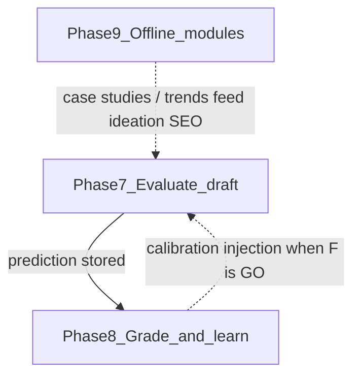

# Phase 8 — Validation Feedback Loop

**Status:** Engineering largely done (phases A–J); Phase F still **NO-GO** for turning calibration/injection ON in prod  
**What it is:** After posts get real engagement, grade predictions, store lessons, optionally calibrate scores and inject lessons back into the predictor — with hard safety gates.

Yes — in the numbered phase ladder this is the **feedback-loop** phase. Internally the work was tracked as lettered sub-phases **A–J** (plus G+), not as “T8.x” spreadsheet rows.

**Active docs:** [`current md/`](current%20md/README.md)  
**Do not confuse with:** [Phase 7](Phase_7.md) (multi-agent evaluation) or [Phase 9](Phase_9.md) (offline independent modules A1–A4).

---

## Start here

| Priority | Doc | What it is |
|----------|-----|------------|
| 1 | [current md/11_GO_NO_GO.md](current%20md/11_GO_NO_GO.md) | Latest ship decision (calibration / injection ON or OFF) |
| 2 | [current md/10_PRODUCTION_RUNBOOK.md](current%20md/10_PRODUCTION_RUNBOOK.md) | Safe flags, how to run evals / staging ops |
| 3 | [current md/09_BUILD_PLAN.md](current%20md/09_BUILD_PLAN.md) | Living A–J checklist |
| 4 | [current md/FEEDBACK_LOOP_FUTURE_AFTER_H.md](current%20md/FEEDBACK_LOOP_FUTURE_AFTER_H.md) | What’s next after H |
| 5 | [current md/FEEDBACK_LOOP_GAPS_A_H.md](current%20md/FEEDBACK_LOOP_GAPS_A_H.md) | Open vs deferred |
| 6 | [current md/12_AGE_AWARE_VALIDATION.md](current%20md/12_AGE_AWARE_VALIDATION.md) | Age/mode metadata + optional learning filter |

Root stubs [`FEEDBACK_LOOP_GAPS_A_H.md`](FEEDBACK_LOOP_GAPS_A_H.md) and [`FEEDBACK_LOOP_FUTURE_AFTER_H.md`](FEEDBACK_LOOP_FUTURE_AFTER_H.md) redirect into `current md/`.

---

## Letter phases (A–J) at a glance

| Letter | Name | Status (short) |
|--------|------|----------------|
| **0** | Foundation (validation grading) | Done |
| **A** | Passive calibration | Done, prod OFF |
| **B** | Structured feedback records | Done |
| **C** | Deterministic cluster routing | Done |
| **D** | Feedback injection | Done, prod OFF |
| **E** | Observability | Done |
| **F** | Prove lift (go/no-go) | NO-GO (lift below bar) |
| **G** | LLM hybrid lessons + review | Staging |
| **H** | Embeddings / centroids / ranked retrieve | Staging |
| **I** | Scale (async queue + roll-ups) | Done |
| **J** | Injectability / shadow | Live hard_lock; shadow ON |
| **G+** | Auto-approve hybrid | Done, default OFF |

**Safe live defaults:** feedback records ON; calibration OFF; prompt injection OFF; shadow ON. Do not flip calibration or injection ON until Phase **F** is GO.

Plain-English dashboard copy lives in [`dashboard/documents_catalog.py`](dashboard/documents_catalog.py) (`phases-a-j`).

---

## How Phase 8 relates to 7 and 9

- **Phase 7** scores and improves a draft *before* publish.
- **Phase 8** learns from *what actually happened* after publish/validation.
- **Phase 9** runs offline batch jobs (anomalies, trends, comments, engagement decay) that enrich the corpus and later agents — not the live request path.
