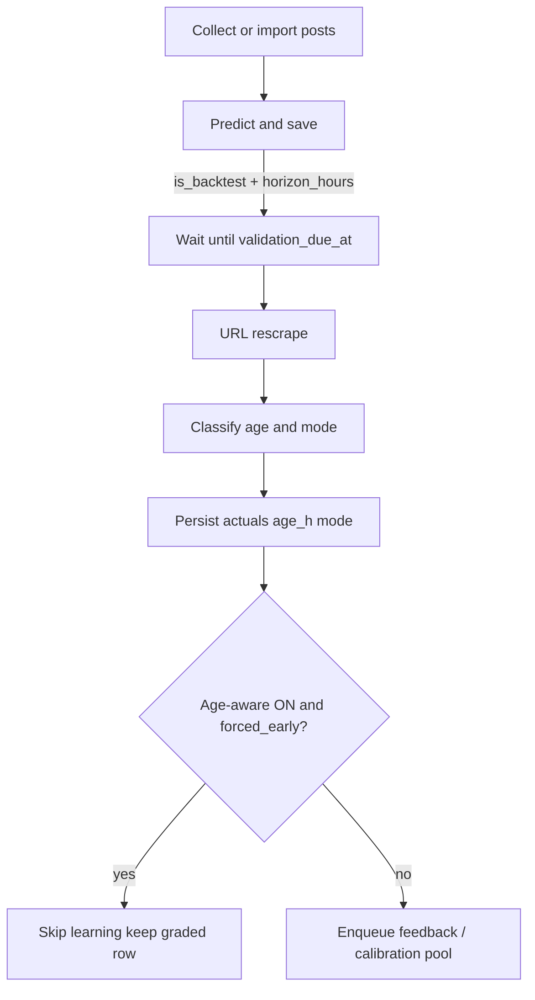

# 12 — Age-Aware Validation (Learning Filter)

**Status:** Implemented (default OFF)  
**Date:** 2026-07-22  
**Purpose:** Stop immature engagement (e.g. posts graded at 5 hours) from skewing AI calibration and feedback lessons, without changing day-to-day collect/rescrape when the feature is off.

---

## Problem

The validation pipeline schedules re-scrape around `posted_at + 48h`, but **scoring treated every rescrape as ground truth** regardless of how old the post actually was at grade time.

That mixed:

| Scenario | Engagement at grade time | Fair vs mature predictor target? |
|----------|--------------------------|----------------------------------|
| Live wait ~48h | Early-mature | Mostly yes |
| Backtest on 5–7 day posts | Final / near-final | Yes |
| Force-validate a 5h-old post | Very early | **No — skews learning** |
| Mixed ages in one accuracy pool | Mixed | **No** |

Narrowing Apify scrapes to “exactly 48h old” previously caused thin results and rate-limit pain. Age metadata + a learning filter avoids that.

---

## What we built

### Design (option 2)

1. **Always record** post age and a validation mode when a row is graded.
2. **Optionally filter learning** when `VALIDATION_AGE_AWARE_ENABLED=true`:
   - Exclude `forced_early` from calibration averages, feedback enqueue/batch, lesson injection, and cluster-stat refresh.
3. **Default OFF** — collect, predict, rescrape, and score behave as before (plus new metadata columns).

This is a **data-quality lane for the AI**, not a new scrape strategy.

### Validation modes

| Mode | When assigned | Learning when filter ON |
|------|---------------|-------------------------|
| `live_48h` | Live lane; age within horizon ± tolerance (default 48 ± 6h) | Included |
| `live_out_of_window` | Live lane; outside ± tolerance (usually older) | Included |
| `backtest_mature` | `is_backtest=true` and age ≥ mature min (default **72h**) | Included |
| `forced_early` | Too young: live &lt; horizon−tolerance, or backtest &lt; 72h | **Excluded** |

Legacy rows with `validation_mode IS NULL` stay eligible when the filter is ON.

### New / updated fields on `predictions`

| Column | Set when | Meaning |
|--------|----------|---------|
| `is_backtest` | Insert (predict/save) | Backtest checkbox / vectorized backtest import |
| `prediction_horizon_hours` | Insert | Intended grade horizon (from `validation_window()`) |
| `validation_age_hours` | Validate | `(validated_at − posted_at)` in hours |
| `validation_mode` | Validate | One of the modes above |

Schema: `storage/schema.sql` (`CREATE` + `ALTER … IF NOT EXISTS` for existing DBs).  
`create_schema()` applies this on next DB connection.

---

## How to turn it on / off

### Env (base defaults)

```bash
VALIDATION_AGE_AWARE_ENABLED=false          # master switch (default)
VALIDATION_AGE_WINDOW_TOLERANCE_HOURS=6     # live window ± hours around horizon
VALIDATION_BACKTEST_MATURE_MIN_HOURS=72     # backtest maturity gate
VALIDATION_WINDOW_HOURS=48                  # existing horizon (unchanged)
```

### Dashboard

**Validation Pipeline → Feedback Loop → “Age-aware learning filter”**

Saved into `data/feedback_loop_overrides.json` (same override system as calibration / injection). Overrides win over `.env` on the next `load_settings()`.

### After flipping ON

Refresh cluster stats once so cached `prediction_clusters.mean_delta` matches the filter:

- Dashboard: Feedback Loop → refresh cluster stats, or  
- CLI: `python -m feedback.jobs.run_cluster_rollups` (passes the flag from settings)

---

## Runtime flow



### Key code

| Piece | Location |
|-------|----------|
| Classify / eligibility / SQL fragment | `validation_pipeline/age_aware.py` |
| Compute + persist at grade time | `validation_pipeline/worker.py` |
| Columns + `mark_validated` | `validation_pipeline/store.py`, `schemas.py` |
| `is_backtest` on save | `predict.save_prediction`, `pipeline`, `corpus_import`, `vectorized_corpus`, Collect UI |
| Feedback enqueue / batch skip | `feedback/batch.py` |
| Calibration + cluster refresh filter | `feedback/store.py` |
| Injection retrieval filter | `feedback/retrieve.py` |
| Predict-time calibration / injection | `validation_pipeline/predict.py` |
| Settings + UI toggle | `config/settings.py`, `feedback/runtime_flags.py`, `feedback/ui.py` |
| Queue columns `age_h` / `mode` | `validation_pipeline/ui.py` |

---

## Operator guidance

### Live validation
Prefer natural due times (`posted_at + 48h`). Avoid force-validating very young posts if you care about learning quality. With the filter ON, those rows still grade for inspection but do not enter the AI pool.

### Backtest
Use already-aged posts (**≥ ~3 days / 72h**). Enable **Backtest mode** on Collect so `is_backtest=true` and engagement is stripped. Due-immediately is fine; maturity is judged from `posted_at`, not wall-clock wait.

### Do not
Re-introduce narrow Apify “only 48h posts” search filters for this. Broad scrape + local `posted_at` / age metadata is the intended approach.

---

## Tests

```bash
python3 -m pytest \
  tests/test_validation_age_aware.py \
  tests/test_feedback_age_aware_enqueue.py \
  tests/test_validation_worker.py \
  tests/test_feedback_calibration.py \
  -q
```

Covers mode classification, learning eligibility, enqueue gating, calibration SQL filter, and worker persistence of age/mode.

---

## Known caveats

1. **Cluster calibration uses cached stats** — after enabling the filter, refresh cluster stats so cluster `mean_delta` excludes `forced_early`.
2. **Manual “regenerate feedback”** can still write lessons for a `forced_early` row (intentional escape hatch). Auto enqueue/batch honor the filter.
3. **Backtests under 72h** are labeled `forced_early` and excluded when the filter is ON — use older corpus posts for backtest learning.
4. **Not decay curves** — this does not normalize 5h engagement to a 48h equivalent (T7 A4). It only tags and optionally excludes immature grades.

---

## Files touched (implementation)

- New: `validation_pipeline/age_aware.py`
- New tests: `tests/test_validation_age_aware.py`, `tests/test_feedback_age_aware_enqueue.py`
- Pipeline / store / worker / schemas / UI / collect
- Feedback batch, store, retrieve, UI, runtime flags, cluster CLI jobs
- `storage/schema.sql`, `config/settings.py`, `README.md` (safe baseline note)
- This doc: `current md/12_AGE_AWARE_VALIDATION.md`

---

## Related docs

- Feedback loop status: [README.md](README.md)
- Production flags: [10_PRODUCTION_RUNBOOK.md](10_PRODUCTION_RUNBOOK.md)
- Go / no-go: [11_GO_NO_GO.md](11_GO_NO_GO.md)
- Future / decay curves: [FEEDBACK_LOOP_FUTURE_AFTER_H.md](FEEDBACK_LOOP_FUTURE_AFTER_H.md)
